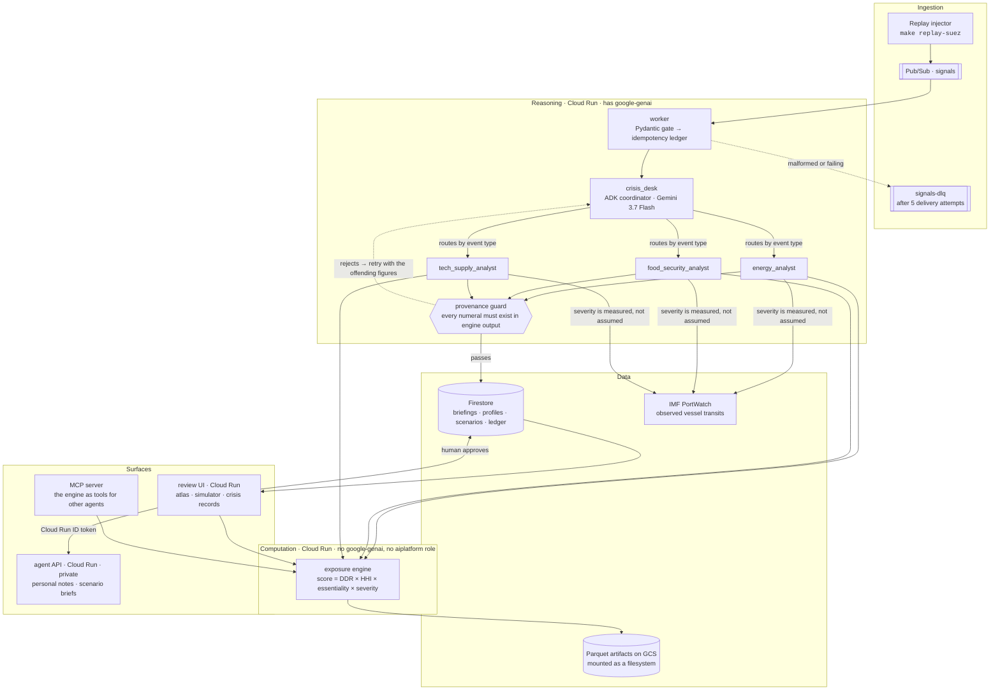
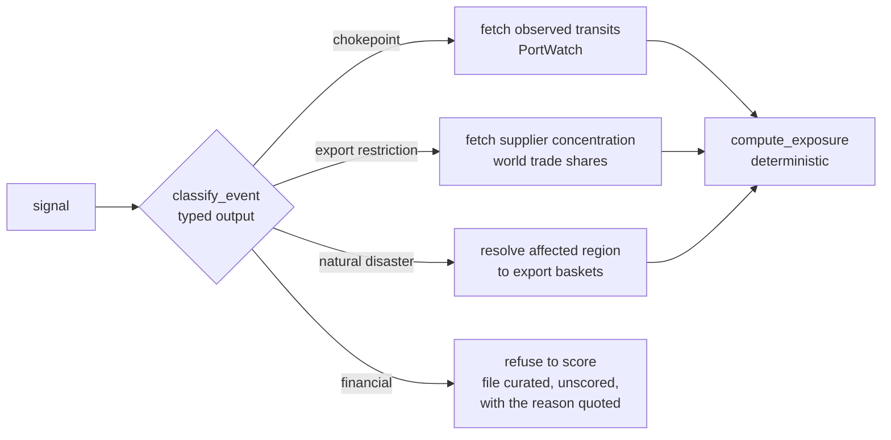

# Autonaly

**An autonomous crisis-impact analyst.** A raw signal arrives — a canal blocked, a strait
threatened, an export ban announced. The agent classifies the event, routes it to the right
data sources, computes country-level trade exposure with a deterministic engine, drafts a
briefing around the computed figures, and files it for one-click human approval.

> **Gemini reasons and routes. A deterministic engine computes. A human approves.**
>
> The model never generates a number. Every figure in a briefing traces to a BACI or
> PortWatch row and a published formula — see [METHODOLOGY.md](METHODOLOGY.md).

---

## Why this shape

Three properties drive the design, and each one is enforced by structure rather than by
good intentions.

**The LLM cannot invent figures.** The exposure engine is a separate service with no
`google-genai` dependency at all. It is not "asked" to avoid calling a model; it cannot.
The agent passes engine output into the briefing composer as data, and a test asserts every
numeral in the narrative appears in the engine response.

**The system knows when its data is untrustworthy.** Chokepoint severity is measured from
observed vessel transits rather than assumed. That feed can degrade — GPS jamming around
the Strait of Hormuz is a documented problem — so an observation whose baseline has
collapsed relative to its long-run level is flagged and **refuses to yield a severity**,
escalating to human review instead. Publishing a confident number derived from a broken
sensor is the failure this design treats as unacceptable.

**Everything runs locally.** Pub/Sub and Firestore run as emulators, artifacts sit on the
filesystem, and one environment variable switches the whole system to real GCP. Vertex AI
is the only dependency with no local substitute. You can therefore run this on a laptop.

---

## Architecture



The deterministic boundary is enforced three times over: the engine image contains no
`google-genai`, its service account holds no `aiplatform` role, and no module imports a model
client. It cannot call an LLM even if someone wrote the code that tried.

### Routing is the decision

The agent's one genuinely autonomous choice is which specialist handles a signal, and that
choice changes which data source is consulted:



A financial crisis is not a gap in coverage — it is a deliberate refusal. Banking and currency
crises transmit through capital flows, which customs data cannot see, so the desk files them
unscored rather than inventing a number.

### The `local | gcp` seam

Three ports, one settings object, one environment variable:

| Concern | `AUTONALY_ENV=local` | `AUTONALY_ENV=gcp` |
|---|---|---|
| Artifacts | filesystem | filesystem — a Cloud Storage volume mount |
| Signals | Pub/Sub emulator | Pub/Sub + DLQ |
| Review queue | Firestore emulator | Firestore |
| Engine, agent, worker, UI | uvicorn / `next dev` | Cloud Run |
| **Gemini** | **real Vertex AI** | **real Vertex AI** |

Pub/Sub and Firestore run *identical client code* in both environments — the emulator
host variables do the work, so there is no local/cloud fork to drift.

Artifacts ended up with no fork either. The original plan read `gs://` URIs through
DuckDB's httpfs, but httpfs authenticates to GCS only with static HMAC interoperability
keys and otherwise requests anonymously (a 403, discovered on the first cloud query).
Trading a runtime service account for long-lived keys — to read public-domain trade data —
was the wrong direction, so the bucket mounts into the container instead and the engine
reads plain files everywhere. The cloud query is byte-identical to the local one.

---

## Quickstart

Requires Python 3.12 (pinned), Docker, and a GCP project with the Vertex AI API enabled.

```bash
uv sync --all-packages     # install the workspace
make up                    # Pub/Sub + Firestore emulators in Docker
make smoke                 # verify all three ports + one real Gemini call
```

`make smoke` is the gate that proves the environment works. It exercises each port against
its local substitute and makes one real structured-output call to Vertex, reporting each
leg independently so a billing problem on Vertex cannot mask the state of the others.

### Build the exposure data

```bash
make data       # download + extract CEPII BACI (~287MB, parallel ranged fetch)
make pipeline   # BACI -> DDR/HHI -> Parquet artifacts, quality gates enforced
```

The refinery processes 11.25M bilateral trade rows in about six seconds and will not emit
artifacts unless all seven data-quality gates pass.

CEPII throttles to roughly 50 KB/s per connection but honours byte ranges, so
`scripts/fetch_baci.sh` uses ten parallel ranged connections — about 10 minutes instead of
100. It is resumable and verifies archive integrity.

### Run the engine

```bash
make engine-local   # uvicorn on :8080

curl -s localhost:8080/exposure -H 'content-type: application/json' -d '{
  "event_key": "black-sea-wheat",
  "sources": ["RUS", "UKR"],
  "baskets": ["wheat"],
  "severity": {"label": "severe", "transit_reduction": 1.0, "duration_months": 6}
}'
```

`GET /baskets` and `GET /chokepoints` expose the valid keys — the agent discovers them
rather than guessing.

### Tests

```bash
make test    # 208 tests
```

The suite runs offline. Unit tests use in-memory fakes; PortWatch tests read snapshotted
fixtures; golden-case tests run against built artifacts and skip cleanly when absent.

---

## Repository layout

```
packages/
  autonaly_core/       event schema, settings, the three ports, 22 commodity baskets,
                       chokepoint routing, conflict channels, 118 curated crises
  autonaly_pipeline/   BACI -> DuckDB -> Parquet refinery + quality gates
  autonaly_engine/     deterministic exposure service (FastAPI, no LLM)
  autonaly_agent/      ADK coordinator, three specialists, typed tools,
                       provenance guard, personalisation + scenario briefs
  autonaly_ingest/     PortWatch client, Pub/Sub topology, worker, replay injector
  autonaly_mcp/        MCP server — the engine as tools for other agents
web/                   Next.js UI: atlas, simulator, crisis records, review queue
infra/                 Dockerfiles and Cloud Build configs for the four services
scripts/deploy.sh      idempotent cutover: build images, deploy Cloud Run
tests/golden/          known-history regression suite
```

## Stack

| Layer | Choice | Why |
|---|---|---|
| Agent framework | **Google ADK** (Python) | Coordinator plus three sub-agents; a transfer between them is the routing decision, and it appears in the trace |
| Model | **Gemini 3.7 Flash** on Vertex AI | Served from the `global` endpoint — 3.x returns 404 in `us-central1` |
| Compute | **Cloud Run** ×4 | engine (public), agent API (private), worker (always-on subscriber), UI |
| Messaging | **Pub/Sub** + dead-letter topic | Five delivery attempts, then the DLQ; idempotency keyed on a content hash |
| State | **Firestore** | Briefings, analyst profiles, saved scenarios, the processed-signal ledger |
| Artifacts | **GCS**, mounted as a volume | DuckDB reads plain files in both environments — see the seam note above |
| Analytics | **DuckDB** over Parquet | 11.25M rows scanned in-process; no warehouse to operate |
| Frontend | **Next.js 16** + **MapLibre GL** | Open-source map, no token fees; vendored dist to avoid a worker/bundler bug |
| Auth | **Clerk** | Sessions for the personal analyst; Google Docs export uses its own narrow grant |
| Agent interop | **MCP** | Eight tools over the same engine, so other agents can query it |

## Status

| Component | State |
|---|---|
| Event schema, ports, settings | working |
| BACI refinery + quality gates | working |
| Commodity baskets (22) + chokepoint routing | working |
| Exposure engine + chokepoint route | working |
| PortWatch observation + degradation guard | working |
| ADK agent, sub-agents, and tools | working |
| Pub/Sub ingestion, DLQ, replay injector | working |
| Scenario simulator (chokepoint, port, conflict) | working |
| Crisis history — 118 curated events, 1914–2024 | working |
| Review UI, personal analyst, saved scenarios | working |
| MCP server (engine as agent-queryable tools) | working |
| GCP deployment | deployed to Cloud Run |

## Data sources

| Source | Role | Licence |
|---|---|---|
| [CEPII BACI](http://www.cepii.fr/CEPII/en/bdd_modele/bdd_modele_item.asp?id=37) | Bilateral HS6 trade, ~200 countries | Etalab 2.0, attribution required |
| [IMF PortWatch](https://portwatch.imf.org/) | Chokepoint vessel transits | Free; cite UN Global Platform; IMF PortWatch |
| [USGS Mineral Commodity Summaries](https://www.usgs.gov/centers/national-minerals-information-center) | Critical-mineral concentration | US Government public domain |
| [World Bank WDI](https://databank.worldbank.org/source/world-development-indicators) | Country context: population, GDP, income group | CC BY 4.0 |
| Crisis history (118 events, 1914–2024) | Curated in this repository, reviewed in version control | Facts of record; each entry cites its own account |

Data: BACI/CEPII (Etalab 2.0) · UN Global Platform; IMF PortWatch

## Not what this is

Autonaly publishes **exposure**, not probability, and history, not forecasts. It does not
originate risk estimates, price targets, or trade recommendations. Exposure scores are
informational and depend on stated simplifications documented in
[METHODOLOGY.md](METHODOLOGY.md) — most importantly that they use latest-year trade weights
and model first-order effects only.
